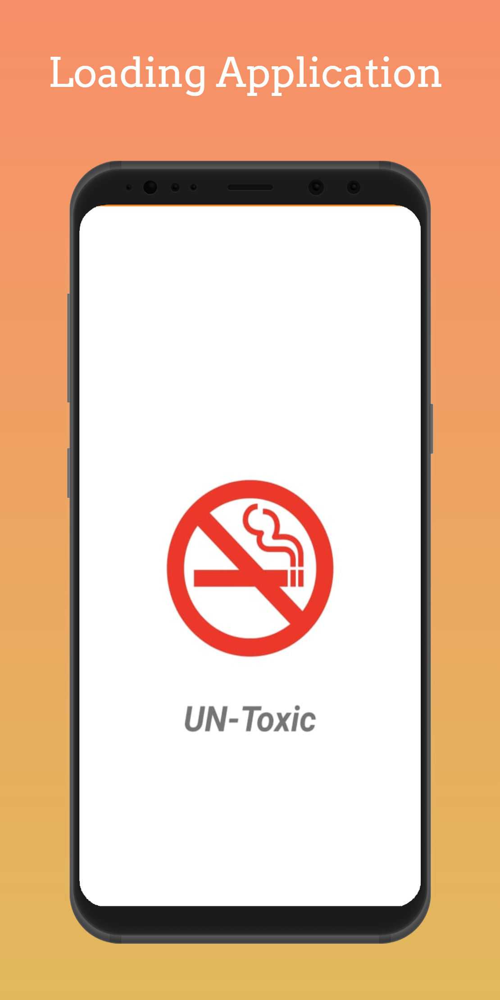
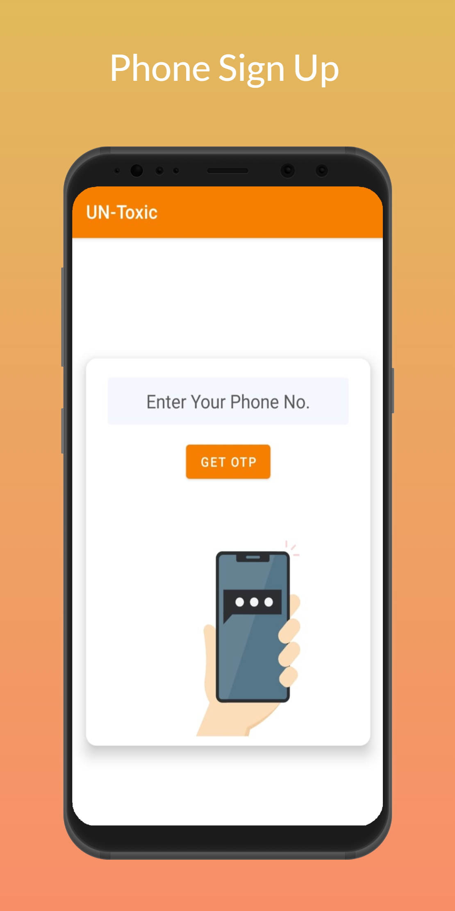
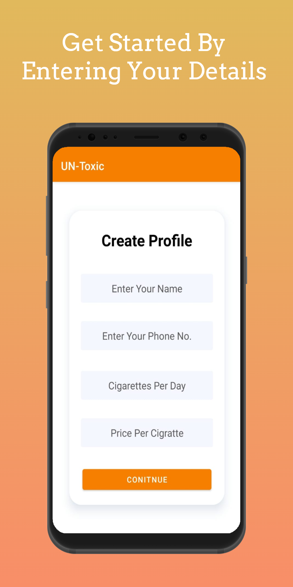
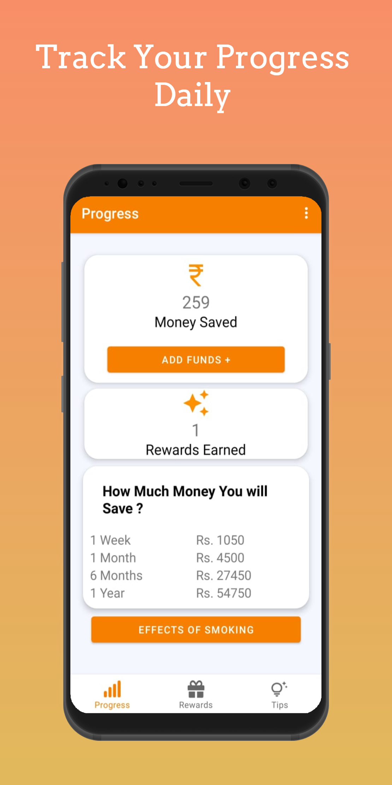
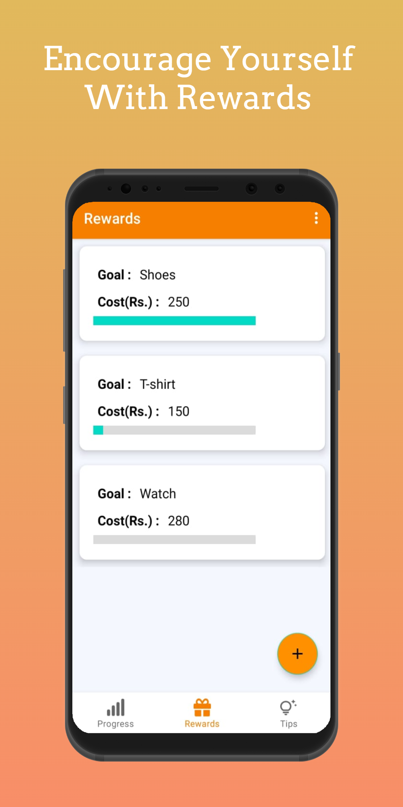
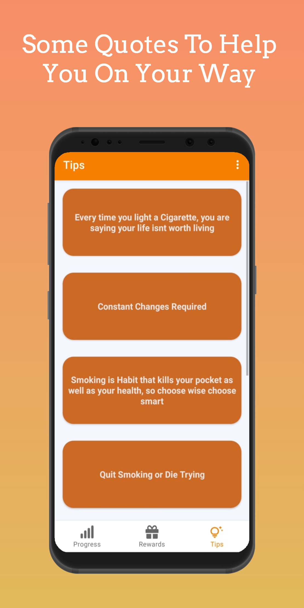

# UN-Toxic

### Problem Statement:
There are about 1.3 billion tobacco users currently in the world, and almost 20-30% outof those die every year due to smoking. Smoking is not only harmful for us humans but causes a lot of damage to Mother Nature as well. It has become a huge point of concern which is been neglected by everybody.

### Proposed Solution:
Un-Toxic helps people who smoke, to live a better life by helping them quit smoking. It motivates, tracks their progress and Keeps them on toes by showing some harmful effects of smoking. This app not only helps people quit smoking, but also keeps mother nature clean and harmless.

### Application Images:  
                                                                              

### Functionality & Concepts used:
The App has a very simple and interactive interface that helps the user to QUIT SMOKING and Live a better life.
Following are a few android concepts used to achieve the functionalities in the app:

  1. Constraint Layout: Most of the activities in the app uses a flexible constraint layout, which is easy to handle for different screen sizes.
  2. Simple & Easy Views Design: Use of familiar audience EditText with hints and interactive buttons made it easier for Users to register or sign in without 
  providing any detailed instructions pages. Apps also use App Navigation to switch between screens of Progress, Rewards and Tips.
  3. Recycler-View:  To present the Quotes and display the Goals of Users. 
  4. LiveData & Room Database: We are also using LiveData to update the status of goal acheived by user, user information, money added to the wallet in the app, etc. 
  The User Can Update their personal information, add funds to their wallet, and set different goals.

